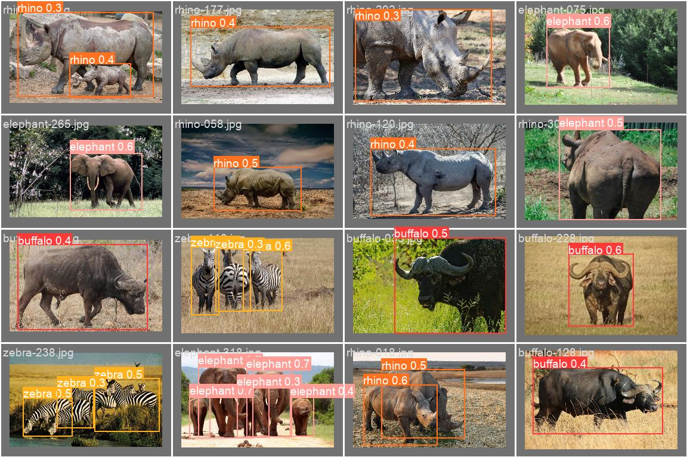

# African Wildlife Detection

This is a simple object detection pipeline with YOLOv8 model from [ultralytics][ultralytics]. The objective is to detect 4 african animal species: buffalo, elephant, rhino, and zebra. The dataset is an [African Wildlife][dataset] dataset from Kaggle.



## Steps

1. Create a `data` folder under your project root.
2. Create a virtual environment (optionally) using virtual environment tool of your choice and install project dependencies
   
   ```bash
   pip install -r requirements.txt
   ```

3. Download the [dataset][dataset] and unpack it to `data/african_wildlife/raw` folder, so that you have 4 folders, namely

    - `data/african_wildlife/raw/buffalo`
    - `data/african_wildlife/raw/elephant`
    - `data/african_wildlife/raw/rhino`
    - `data/african_wildlife/raw/zebra`

4. Run the `convert.py` script to convert the data to YOLOv8 format:

   ```bash
   python3 african_wildlife_detection/convert.py
   ```

5. Make sure the processed dataset is available under the `data/african_wildlife/processed` folder and run the training script

   ```bash
   python3 african_wildlife_detection/train.py
   ```
  
   If you have CUDA device available on your machine, you can add a `device` parameter to the `model.train` call or use CLI instead of the `train.py` script.
 
6. After training is complete, check the results under the `runs` folder.

[dataset]: https://www.kaggle.com/datasets/biancaferreira/african-wildlife
[ultralytics]: https://docs.ultralytics.com
